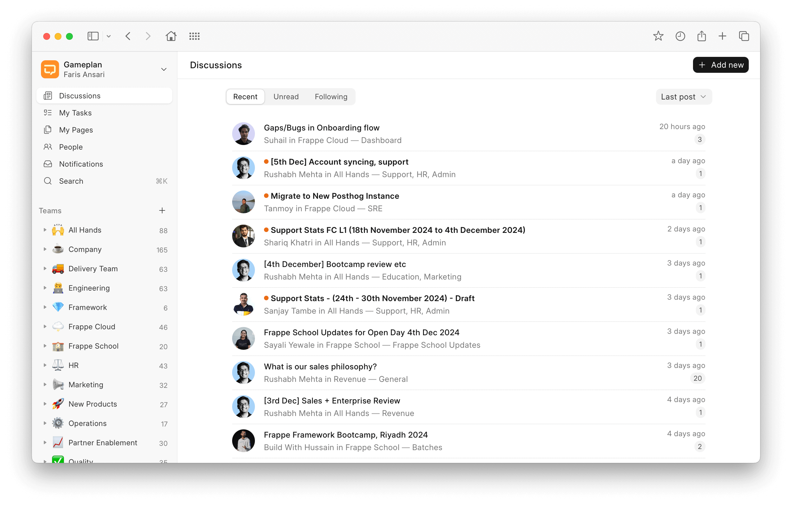

<div align="center" markdown="1">


<h1>Gameplan</h1>

**Open Source Discussions Platform for Remote Teams**

<a href="https://dashboard.cypress.io/projects/y2q697/runs">
    
</a>


<div>
    <picture>
        <source media="(prefers-color-scheme: dark)" srcset=".github/assets/gameplan-hero-dark.png">
        
    </picture>
</div>

</div>

## Gameplan

Gameplan is an async-first discussions tool for remote teams. It encourages thoughtful communication and deep-thinking.

### Motivation
We've been remote first since day one, but as our team grew, chat tools like Telegram fell short. Missing out on crucial conversations became a major issue. We needed a better way to keep everyone connected and in sync. That's how Gameplan was born - to solve the problems of modern remote work!

### Key Features
- **Thread-first discussions**: Gameplan lets you start a discussion and have people comment on it at their own pace, encouraging thoughtful conversation and deep thinking. No more feeling obligated to be online all the time.

- **Spaces for organization**: Spaces help you categorize conversations by project, team, client, or topic – whatever makes sense for your team's workflow. This keeps discussions tidy and easy to find.

- **Customizable profiles**: Get a better picture of who's on your team with profiles that let everyone showcase their personality: cover images, short bios, and profile pictures.

- **Pages for note-taking**: Use pages as digital notes to jot down meeting minutes, proposals, ideas – whatever sparks creativity! They can be private by default or shared with just your team or specific spaces.

### Under the Hood

- [Frappe Framework](https://github.com/frappe/frappe): A full-stack batteries-included web framework.
- [Frappe UI](https://github.com/frappe/frappe-ui): A Vue UI library for a modern user interface built on our [design system](https://www.figma.com/community/file/1407648399328528443).
- [Redisearch](https://github.com/RediSearch/RediSearch): A powerful search and indexing engine built on top of Redis.

## Production setup
### Managed Hosting

You can try [Frappe Cloud](https://frappecloud.com), a simple, user-friendly and sophisticated [open-source](https://github.com/frappe/press) platform to host Frappe applications.

It takes care of installation, setup, upgrades, monitoring, maintenance and support of your Frappe deployments. It is a fully featured developer platform with an ability to manage and control multiple Frappe deployments.

<div>
	<a href="https://frappecloud.com/gameplan/signup" target="_blank">
		<picture>
			<source media="(prefers-color-scheme: dark)" srcset="https://frappe.io/files/try-on-fc-white.png">
			
		</picture>
	</a>
</div>

## Development setup
### Docker
You need Docker, docker-compose and git setup on your machine. Refer [Docker documentation](https://docs.docker.com/). After that, run the following commands:
```
git clone https://github.com/frappe/gameplan
cd gameplan/docker
docker-compose up
```

Wait for sometime until the setup script creates a site. After that you can
access `http://localhost:8000` in your browser and Gameplan's login screen
should show up.

Use the following credentials to log in:

- Username: `alex@example.com`
- Password: `123`

### Local

Currently, this app depends on the `develop` branch of [frappe](https://github.com/frappe/frappe).

1. Setup frappe-bench by following [this guide](https://frappeframework.com/docs/v14/user/en/installation)
1. In the frappe-bench directory, run `bench start` and keep it running. Open a new terminal session and cd into `frappe-bench` directory.
1. Run the following commands:
    ```sh
    bench new-site gameplan.test
    bench get-app gameplan
    bench --site gameplan.test install-app gameplan
    bench --site gameplan.test add-to-hosts
    bench --site gameplan.test browse --user Administrator
    ```
 1. Now, open a new terminal session and cd into `frappe-bench/apps/gameplan`, and run the following commands:
    ```
    yarn
    yarn dev
    ```
 1. Now, you can access the site on vite dev server at `http://gameplan.test:8080`

## Links

- [Discuss Gameplan](https://github.com/frappe/gameplan/discussions)

<br>
<br>
<div align="center">
	<a href="https://frappe.io" target="_blank">
		<picture>
			<source media="(prefers-color-scheme: dark)" srcset="https://frappe.io/files/Frappe-white.png">
			
		</picture>
	</a>
</div>
