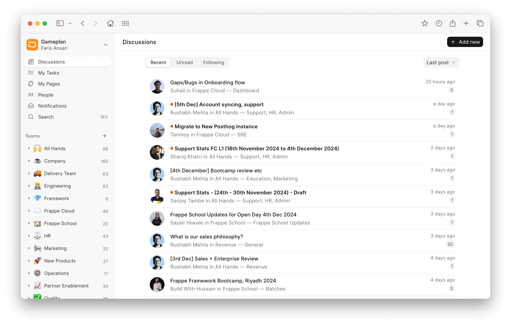

<div align="center" markdown="1">


<h1>Gameplan</h1>

**Open Source Discussions Platform for Remote Teams**

<a href="https://dashboard.cypress.io/projects/y2q697/runs">
    
</a>
<a href="https://github.com/frappe/gameplan/actions/workflows/server-tests.yml">
    
</a>
<a href="https://github.com/frappe/gameplan/actions/workflows/ui-test.yml">
    
</a>


<div>
    <picture>
        <source media="(prefers-color-scheme: dark)" srcset=".github/assets/gameplan-hero-dark.png">
        
    </picture>
</div>

</div>

## Gameplan

Gameplan is an async-first discussions tool for remote teams. It encourages thoughtful communication and deep-thinking.

### Motivation
We've been remote first since day one, but as our team grew, chat tools like Telegram fell short. Missing out on crucial conversations became a major issue. We needed a better way to keep everyone connected and in sync. That's how Gameplan was born - to solve the problems of modern remote work!

### Key Features
- **Thread-first discussions**: Gameplan lets you start a discussion and have people comment on it at their own pace, encouraging thoughtful conversation and deep thinking. No more feeling obligated to be online all the time.

- **Spaces for organization**: Spaces help you categorize conversations by project, team, client, or topic – whatever makes sense for your team's workflow. This keeps discussions tidy and easy to find.

- **Customizable profiles**: Get a better picture of who's on your team with profiles that let everyone showcase their personality: cover images, short bios, and profile pictures.

- **Pages for note-taking**: Use pages as digital notes to jot down meeting minutes, proposals, ideas – whatever sparks creativity! They can be private by default or shared with just your team or specific spaces.

### Under the Hood

- [Frappe Framework](https://github.com/frappe/frappe): A full-stack batteries-included web framework.
- [Frappe UI](https://github.com/frappe/frappe-ui): A Vue UI library for a modern user interface built on our [design system](https://www.figma.com/community/file/1407648399328528443).
- [Redisearch](https://github.com/RediSearch/RediSearch): A powerful search and indexing engine built on top of Redis.

## Production setup
### Managed Hosting

You can try [Frappe Cloud](https://frappecloud.com), a simple, user-friendly and sophisticated [open-source](https://github.com/frappe/press) platform to host Frappe applications.

It takes care of installation, setup, upgrades, monitoring, maintenance and support of your Frappe deployments. It is a fully featured developer platform with an ability to manage and control multiple Frappe deployments.

<div>
	<a href="https://frappecloud.com/gameplan/signup" target="_blank">
		<picture>
			<source media="(prefers-color-scheme: dark)" srcset="https://frappe.io/files/try-on-fc-white.png">
			
		</picture>
	</a>
</div>

## Supported versions

Gameplan supports Frappe v16 and newer only. Use the following branch pairings:

| Gameplan | Frappe | Recommended for |
| --- | --- | --- |
| `develop` | `version-16` | Stable Frappe v16 installations |
| `develop` | `develop` | Testing upcoming Frappe releases |

Gameplan does not have a separate `version-16` branch. Its `develop` branch is the supported branch for
both pairings. Frappe v15 and older releases are not supported.

## Development setup
### Docker
You need Docker, docker-compose and git setup on your machine. Refer [Docker documentation](https://docs.docker.com/). After that, run the following commands:
```
git clone https://github.com/frappe/gameplan
cd gameplan/docker
docker-compose up
```

Wait for sometime until the setup script creates a site. After that you can
access `http://localhost:8000` in your browser and Gameplan's login screen
should show up.

Use the following credentials to log in:

- Username: `alex@example.com`
- Password: `123`

### Local Development (without Docker)

#### Prerequisites

- The dependencies required by Frappe v16, including Python 3.14, Node.js 24, and Yarn 1.22. See the
  current [Frappe installation guide](https://docs.frappe.io/framework/user/en/installation).
- Bench CLI
- The local frappe-ui copy is included in `./frappe-ui/` for development

#### Step 1: Set up the Backend

Create a Frappe v16 bench and install Gameplan's `develop` branch:

```sh
bench init --frappe-branch version-16 frappe-bench
cd frappe-bench
bench new-site gameplan.test
bench get-app --branch develop https://github.com/frappe/gameplan
bench --site gameplan.test install-app gameplan
bench --site gameplan.test add-to-hosts
bench build --apps gameplan
```

Start the development processes in one terminal:

```sh
bench start
```

In another terminal, create an authenticated browser session when needed:

```sh
bench --site gameplan.test browse --user Administrator
```

To test against the next Frappe release instead, initialize the bench with
`--frappe-branch develop`. Keep Gameplan on `develop` in both cases.

#### Move an existing Gameplan installation from `main` to `develop`

Back up the site first, then switch only Gameplan to its supported branch. If the bench is still on an
older Frappe release, switch Frappe to `version-16` as well:

```sh
cd frappe-bench
bench --site gameplan.test backup
bench switch-to-branch develop gameplan
# Run the next command only when moving the bench to stable Frappe v16.
# Keep Frappe on develop when testing the upcoming release.
bench switch-to-branch version-16 frappe
bench setup requirements
bench --site gameplan.test migrate
bench build --apps gameplan
bench restart
```

Replace `gameplan.test` with the real site name. Review custom apps before switching a shared bench,
because every installed app must support Frappe v16. There is no Gameplan `version-16` branch to switch
to.

#### Step 2: Set up the Frontend

1. Open a new terminal session and navigate to the gameplan app:
    ```sh
    cd frappe-bench/apps/gameplan
    ```

2. Initialize the pinned frappe-ui submodule:
    ```sh
    git submodule update --init --recursive
    ```

3. Install frontend dependencies:
    ```sh
    yarn install --frozen-lockfile
    ```

4. Start the Vite development server with the published frappe-ui package:
    ```sh
    yarn dev
    ```

5. **Optional: For frappe-ui contributors**, install the submodule dependencies and use the local
   checkout:
    ```sh
    (cd frappe-ui && yarn install --frozen-lockfile)
    yarn dev:frappe-ui
    ```

6. Access the application at `http://gameplan.test:8080/g`

#### How local frappe-ui development works

`yarn dev` uses the published frappe-ui version pinned in `frontend/package.json`. The
`yarn dev:frappe-ui` command replaces that installed package with a symlink to the pinned `./frappe-ui/`
submodule for library development. Running `yarn dev` again restores the published package.

**Contributing to frappe-ui**:
- The `frappe-ui` directory is a Git submodule pointing to the [frappe/frappe-ui](https://github.com/frappe/frappe-ui) repository
- If you make changes to frappe-ui, you must submit them as a separate Pull Request to the [frappe-ui repository](https://github.com/frappe/frappe-ui)
- Update the submodule only through a reviewed Gameplan change; do not use `git submodule update --remote`
- Test your frappe-ui changes locally with Gameplan before submitting a PR

#### Frontend Development Environment

- **Vite Dev Server**: Runs on port 8080 by default
- **Frappe Proxy**: Automatically proxies API requests to the backend via `frappeProxy` plugin
- **Type Generation**: TypeScript types are auto-generated from backend doctypes
- **Access URL**: `http://gameplan.test:8080/g`

#### Backend and Frontend Workflow

- Backend runs on `http://gameplan.test:8000` via `bench start`
- Frontend dev server runs on `http://gameplan.test:8080` and proxies API calls to the backend
- The Vite dev server uses HMR (Hot Module Replacement) for instant code updates
- Both must be running simultaneously for local development

## Links

- [Discuss Gameplan](https://github.com/frappe/gameplan/discussions)

<br>
<br>
<div align="center">
	<a href="https://frappe.io" target="_blank">
		<picture>
			<source media="(prefers-color-scheme: dark)" srcset="https://frappe.io/files/Frappe-white.png">
			
		</picture>
	</a>
</div>
